# string-calculator
A Ruby implementation of a String Calculator, following TDD principles. Each requirement is addressed with corresponding tests, code, and screenshots documenting the development process.

## Requirement 1: Empty String

**Steps:**

1.  Write the Test & Run it
    * Test Result (Fail):
        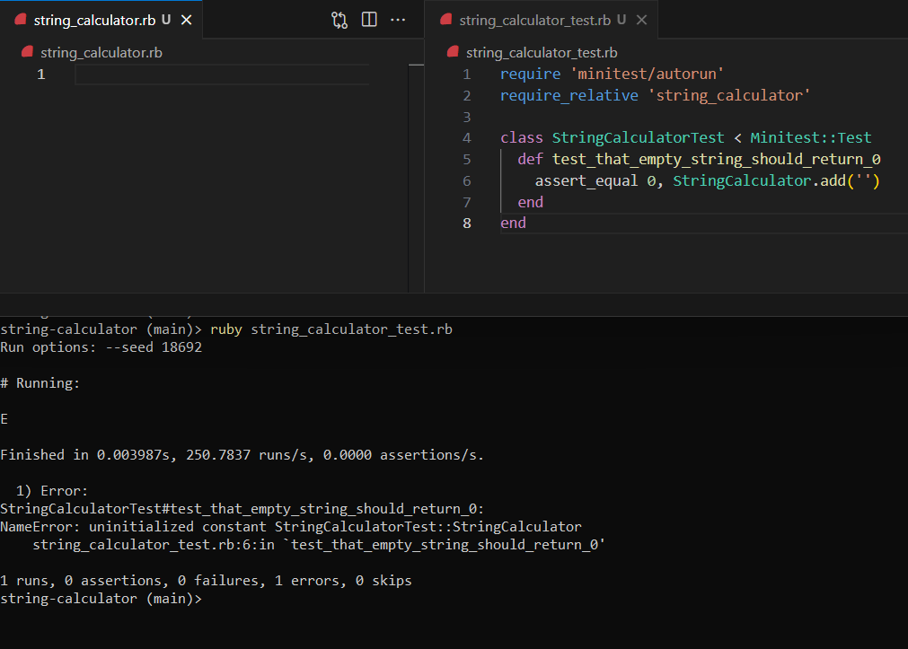
        
2.  Write the Minimal Code & Run it again
    * Test Result (Pass):
        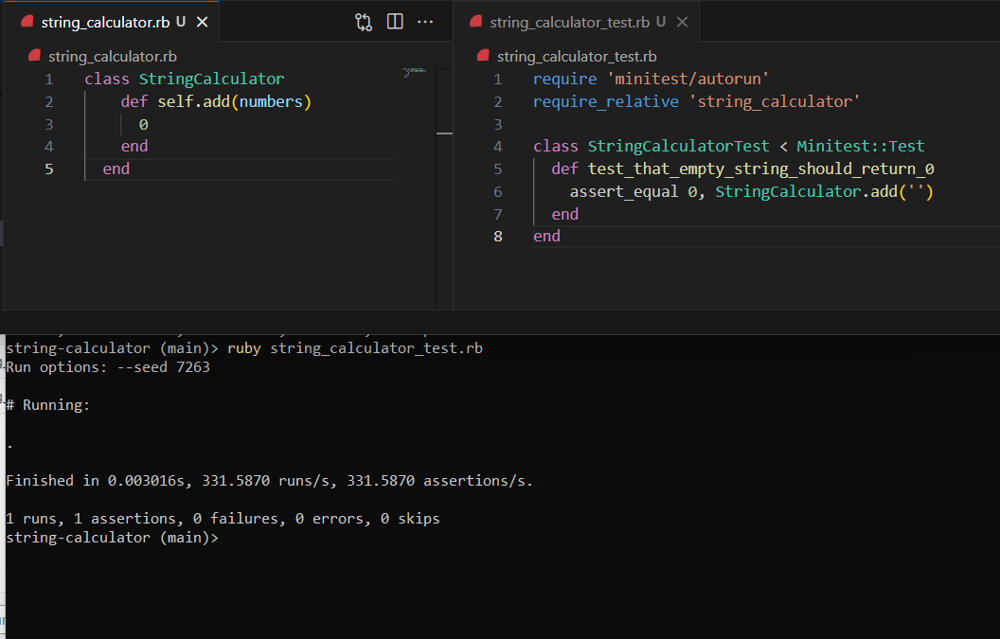

        
## Requirement 2: Single Number

**Steps:**

1.  Write the Test & Run it
    * Test Result (Fail):
        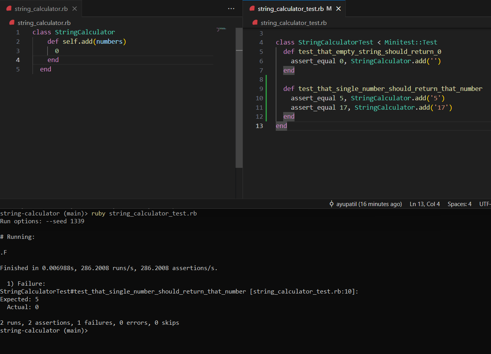
        
2.  Write the Minimal Code & Run it again
    * Test Result (Pass):
        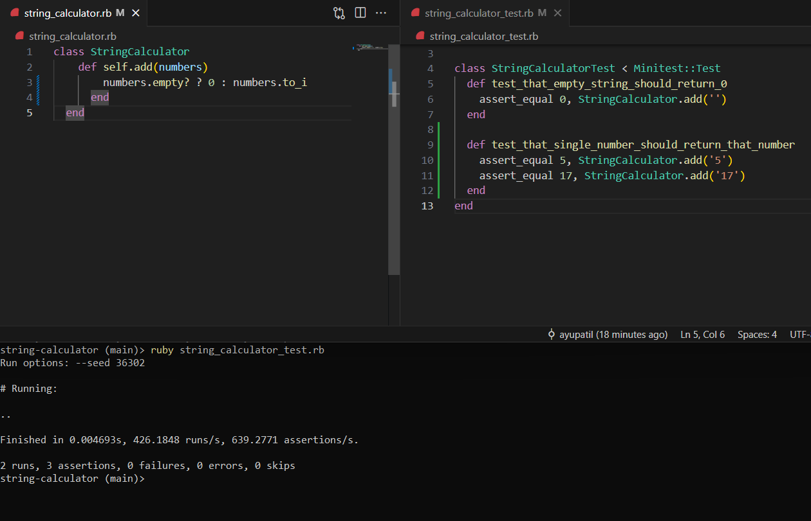
        
        
## Requirement 3: Two Numbers

**Steps:**

1.  Write the Test & Run it
    * Test Result (Fail):
        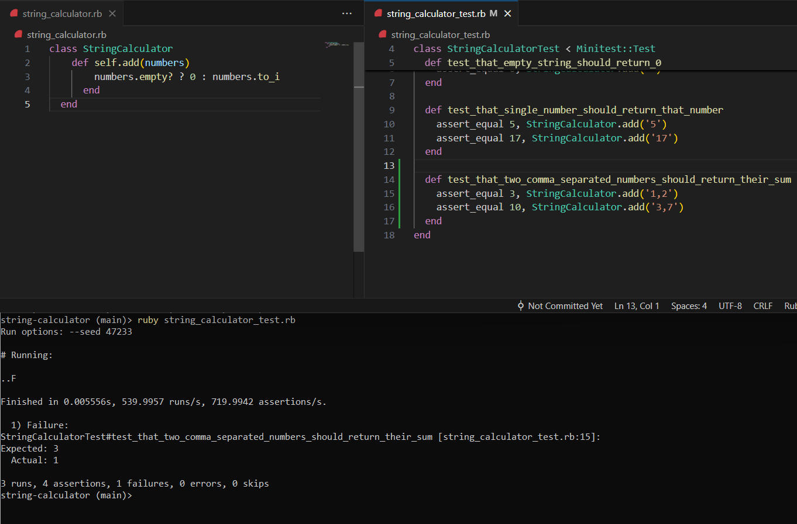
        
2.  Write the Minimal Code & Run it again
    * Test Result (Pass):
        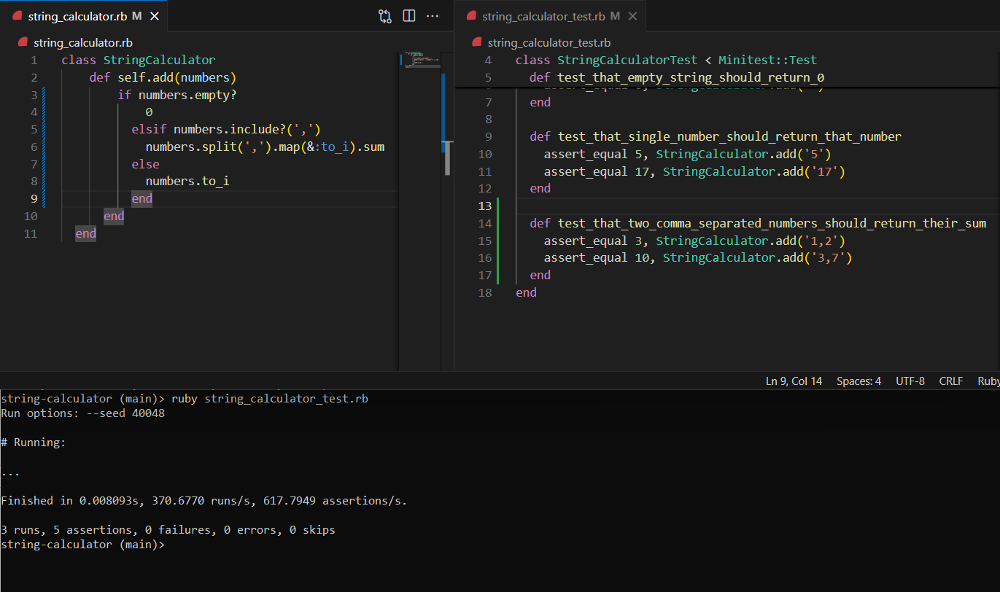

## Requirement 4: Unknown Amount of Numbers

**Steps:**

1.  Write the Test & Run it
    * Test Result (Pass):
        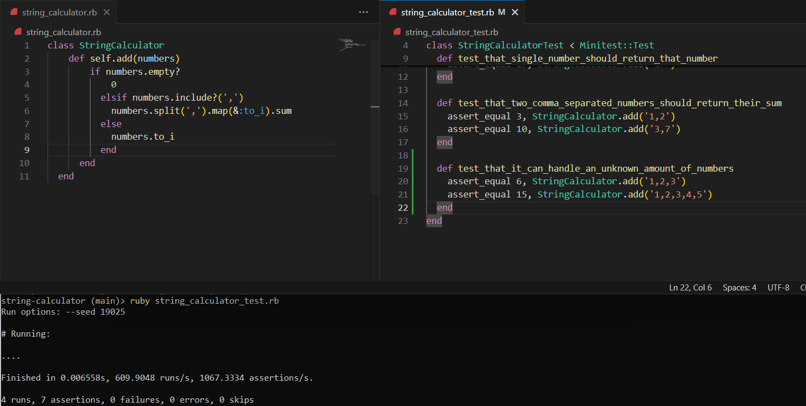
        
        
## Requirement 5: New Lines as Separators

**Steps:**

1.  Write the Test & Run it
    * Test Result (Fail):
        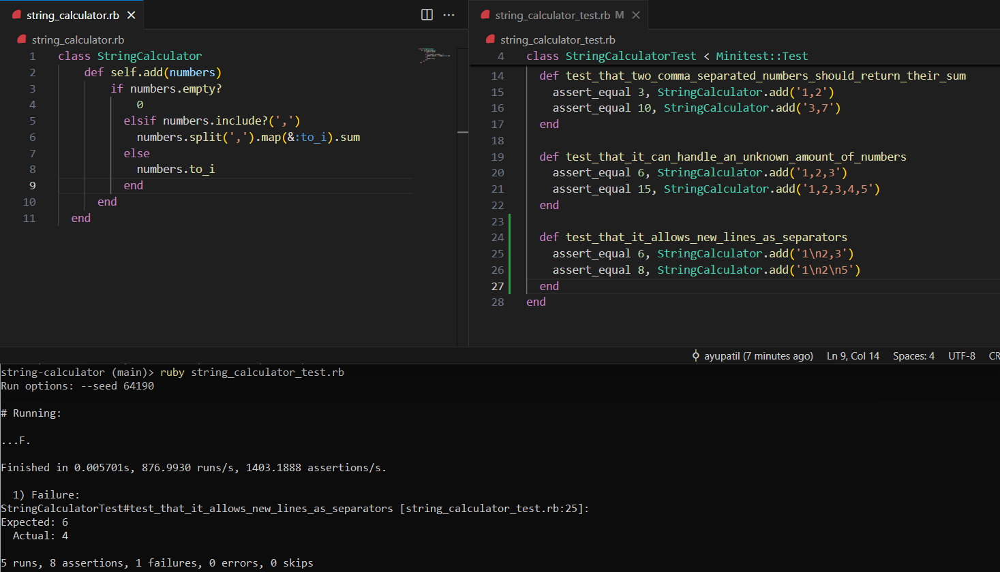
        
2.  Write the Minimal Code & Run it again
    * Test Result (Pass):
        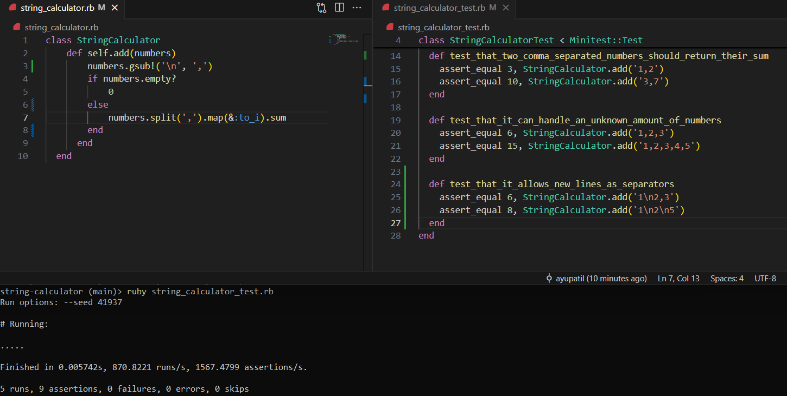

      
## Requirement 6: Custom Delimiters

**Steps:**

1.  Write the Test & Run it
    * Test Result (Fail):
        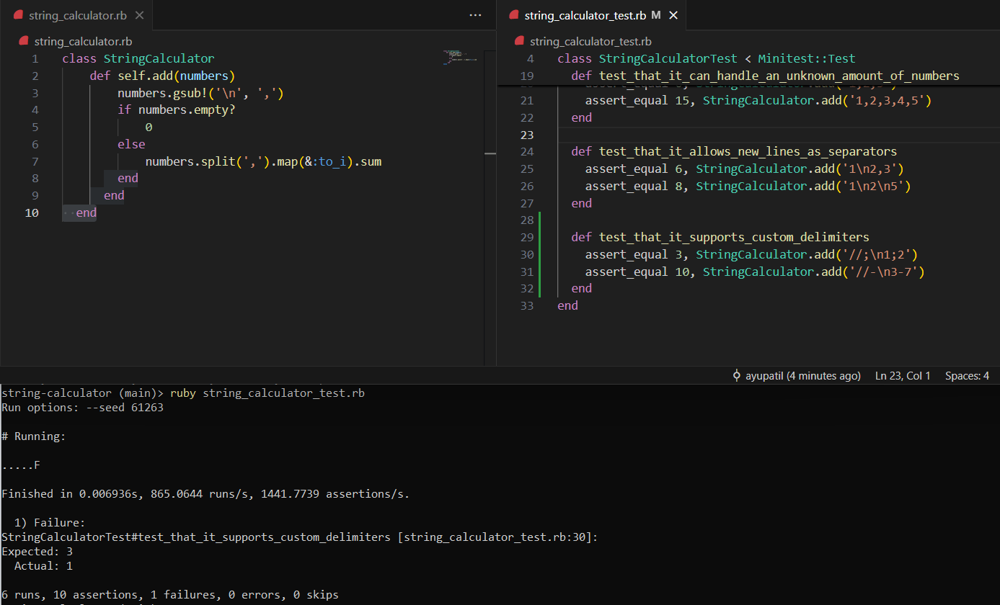
        
2.  Write the Minimal Code & Run it again
    * Test Result (Pass):
        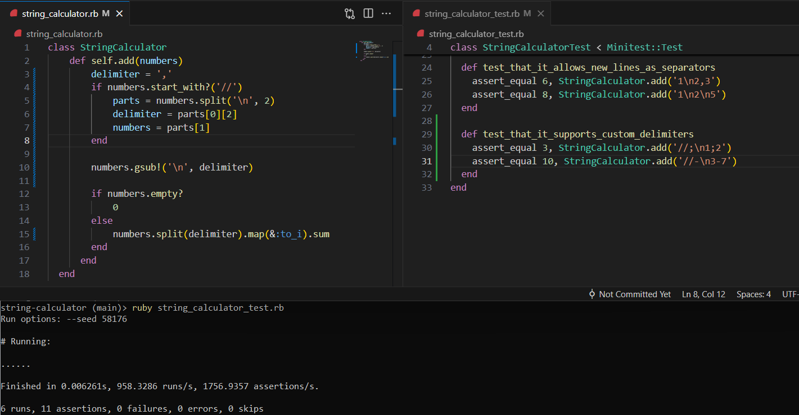

## Requirement 7: Negative Numbers

**Steps:**

1.  Write the Test & Run it
    * Test Result (Fail):
        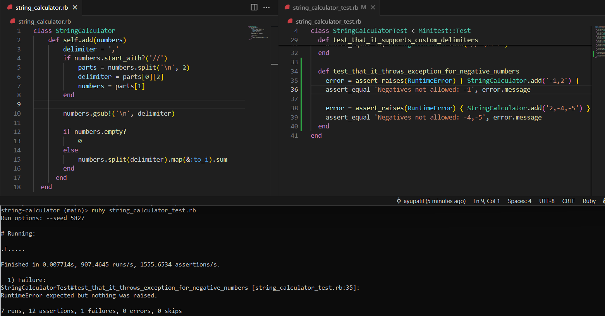
        
2.  Write the Minimal Code & Run it again
    * Test Result (Pass):
        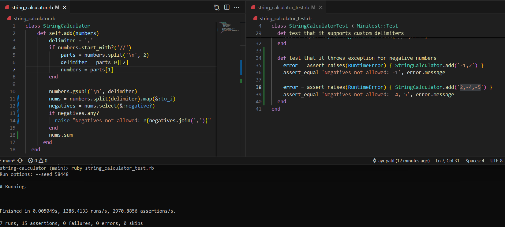
